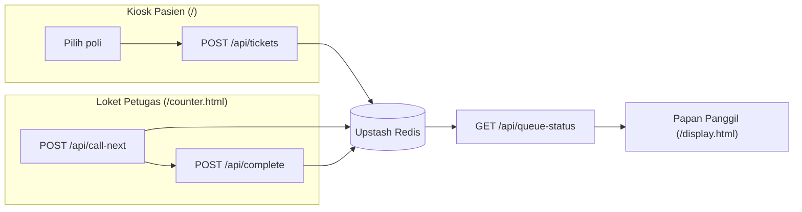

# QueueFlow — Antrian Rumah Sakit

Evolusi dari [QueueFlow](https://github.com) (dulu `antrian-app`), sistem antrian Go yang awalnya dibangun untuk belajar goroutine, channel, dan actor pattern. Versi ini menjaga ide intinya, tapi pindah backend ke Node.js/TypeScript agar bisa deploy gratis, satu repo, langsung di Vercel — tanpa server yang perlu dijaga hidup.

Lima layar:

- **`/` — Kiosk pasien**: isi nama/NIK opsional, pilih poli (poli yang tutup otomatis nonaktif), ambil nomor antrian bergaya tiket sobek dengan QR code.
- **`/counter.html` — Loket petugas**: panggil pasien berikutnya, tandai selesai, lihat loket lain yang aktif di poli yang sama.
- **`/display.html` — Papan panggil**: layar TV ruang tunggu, auto-refresh, mendukung beberapa loket sekaligus per poli, plus panggilan suara (opsional, perlu diaktifkan manual karena browser).
- **`/status.html` — Status tiket pribadi**: dituju lewat scan QR di tiket, menampilkan posisi antrian & estimasi waktu tunggu tanpa perlu berdiri di depan papan panggil.
- **`/admin.html` — Rekap harian**: dikunci PIN (`ADMIN_PIN`), menampilkan jumlah tiket terbit/selesai dan rata-rata waktu layanan per poli.

## Kenapa saya bangun ini

Versi Go aslinya mengajarkan saya actor pattern lewat goroutine dan channel — tiap loket adalah satu goroutine yang jadi satu-satunya pembaca dari channel-nya sendiri, jadi dua loket tidak akan pernah rebutan tiket yang sama. Itu jaminan yang elegan, tapi butuh proses yang hidup terus-menerus, dan Vercel (tempat saya ingin deploy gratis dan publik) menjalankan semuanya sebagai serverless function yang stateless — mati-hidup tiap request.

Jadi pertanyaannya bukan "Go atau Node", tapi: apakah *jaminan* dari actor pattern itu bisa dipertahankan tanpa prosesnya? Ternyata bisa — lihat bagian trade-off di bawah.

## Arsitektur



Setiap poli punya dua antrian di Redis: `queue:{poli}:priority` dan `queue:{poli}:normal`. IGD selalu masuk jalur prioritas dan selalu dilayani lebih dulu — sesuai praktik triase nyata, bukan sekadar "adil" secara FIFO.

## Trade-off yang saya buat dengan sadar

- **Goroutine/channel → Redis `EVAL` atomik.** Jaminan "hanya satu loket yang bisa mengambil tiket ini" dulu datang dari channel Go. Sekarang datang dari Lua script yang dieksekusi atomik (single-threaded) di sisi Redis — dua request `call-next` yang datang bersamaan tetap tidak akan pernah mengambil tiket yang sama. Lihat `api/_lib/actor.js`.
- **Graceful shutdown → self-heal saat dibaca.** Dulu graceful shutdown menjamin tiket yang sedang diproses tidak hilang saat server dimatikan. Sekarang tidak ada server untuk dimatikan — risikonya berubah jadi "loket memanggil tiket lalu tab petugas ditutup sebelum menekan Selesai". Solusinya: tiket yang macet di status `called` lebih dari 5 menit otomatis dikembalikan ke depan antrian saat endpoint manapun berikutnya dipanggil. Tidak butuh cron, tidak butuh proses background.
- **Custom JSON marshaling → satu fungsi `ticketToJSON`.** Prinsipnya sama: bentuk data di wire selalu eksplisit dan konsisten, tidak pernah hasil serialisasi default dari objek mentah.
- **Node dipilih di atas Go untuk backend ini secara spesifik** karena beban kerjanya I/O-bound (baca/tulis Redis, bukan komputasi berat), dan Vercel punya dukungan Node.js/serverless native — nol konfigurasi runtime tambahan, cold start lebih ringan dibanding menjalankan Go di Vercel Functions.
- **NIK/BPJS disimpan tapi tidak pernah ditampilkan utuh.** Dikumpulkan opsional saat ambil nomor (`api/tickets.js`), disimpan di Redis, tapi `ticketToJSON` cuma pernah mengembalikan versi tersamar (`•••• 7890`). Nama pasien juga selalu disamarkan di layar publik (`Budi S.`, bukan nama lengkap). Ini pilihan sadar mengingat papan panggil itu tampilan publik.
- **PIN admin bukan auth sungguhan.** `api/_lib/adminAuth.js` cuma bandingin string di header — cukup buat demo/portofolio, tapi kalau proyek ini mau dipakai produksi dengan data pasien sungguhan, ganti dengan auth session/JWT yang layak.

## Menjalankan lokal

```bash
npm install
cp .env.example .env.local   # isi dua nilai dari Upstash (lihat di bawah)
npx vercel dev
```

## Deploy gratis ke Vercel

1. **Buat Redis gratis** di [console.upstash.com](https://console.upstash.com) → *Create Database* (pilih region terdekat) → buka tab **REST API** → salin `UPSTASH_REDIS_REST_URL` dan `UPSTASH_REDIS_REST_TOKEN`.
2. **Push repo ini ke GitHub**, lalu import di [vercel.com/new](https://vercel.com/new).
3. Di pengaturan project Vercel → **Environment Variables**, tambahkan dua nilai dari langkah 1, plus `ADMIN_PIN` bebas (PIN buat buka `/admin.html`).
4. Deploy. Vercel otomatis mendeteksi folder `api/` sebagai serverless functions dan `public/` sebagai situs statis — tidak ada build step yang perlu dikonfigurasi.
5. Bagikan tiga URL ke pihak yang relevan: `/` (kiosk, bisa jadi tablet di pintu masuk), `/counter.html` (loket), `/display.html` (TV ruang tunggu).

Semua berjalan di Hobby plan Vercel (gratis) + Upstash free tier (gratis untuk trafik skala kecil-menengah) — tidak ada kartu kredit yang perlu terpasang.

## Struktur proyek

```
api/
  _lib/redis.js        klien Redis (Upstash REST, aman untuk serverless)
  _lib/ticket.js         konfigurasi poli, jadwal dokter, serialisasi & masking tiket
  _lib/actor.js           klaim atomik, posisi antrian, multi-loket, self-heal
  _lib/stats.js            statistik harian + rata-rata waktu layanan (EMA)
  _lib/adminAuth.js        gerbang PIN buat endpoint admin
  departments.js          GET  daftar poli + status buka/tutup + kedalaman antrian
  tickets.js                POST ambil nomor antrian baru (nama wajib, NIK opsional)
  tickets/[id].js            GET  status tiket + posisi + estimasi waktu tunggu
  call-next.js               POST panggil pasien berikutnya (per loket)
  complete.js                 POST tandai tiket selesai + update statistik
  queue-status.js              GET  status live untuk papan panggil (multi-loket)
  admin/summary.js              GET  rekap harian, perlu header x-admin-pin
public/
  index.html / js/app.js         kiosk pasien (identitas → poli → tiket + QR)
  counter.html / js/counter.js   loket petugas + loket lain yang aktif
  display.html / js/display.js   papan panggil, multi-loket, panggilan suara
  status.html / js/status.js     status tiket pribadi (tujuan QR code)
  admin.html / js/admin.js       rekap harian, dikunci PIN
  css/style.css                  token desain + komponen tiket sobek
```
