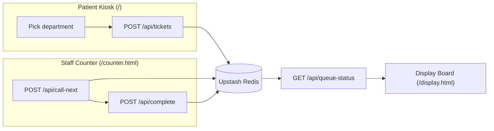

# QueueFlow — Hospital Queue System 🎫

A queue system for hospitals/clinics. Patients grab a number from a kiosk, staff call the next patient from a counter screen, and the result shows up on a display board for the waiting room. Full Node.js + Vue 3 (CDN, no build step), and it deploys for free straight to Vercel.

This is actually a continuation of an older project of mine, [QueueFlow](https://github.com) (formerly `antrian-app`) — a Go version I built to learn goroutines & channels. This version was rebuilt from scratch in Node.js so it could deploy free, single-repo, on Vercel — but the core ideas are still here, just wearing a different shape. More on that in the trade-offs section below.

## What's in it

Three screens:

- **`/`** — patient kiosk, pick a department and get a ticket-stub-styled queue number
- **`/counter.html`** — staff counter screen, "call next" & "done" buttons
- **`/display.html`** — call board meant for a TV in the waiting room, auto-refreshes on its own

## Why it's built this way

Back in the Go version, each counter was its own goroutine, and it was the only one reading from its own channel — so you were guaranteed no two counters would ever grab the same ticket. I really liked that guarantee, but it needs a process that stays alive continuously, and on Vercel everything runs as a serverless function that spins up and down per request.

So the real question wasn't "move to Node or stay on Go" — it was: how do you keep the actor pattern's guarantee alive when the process itself doesn't stay alive? Turns out you still can, it just moves somewhere else — see below.

## Architecture



Each department gets two queues in Redis: one for priority, one for regular. The ER (IGD) always lands in the priority lane and always gets called first — it's not a checkbox a patient could game, it's decided by the department's own config. That matches how real triage actually works, not just FIFO "fairness".

## Trade-offs I made on purpose

- **Goroutines/channels → an atomic Redis `EVAL`.** The old guarantee — "only one counter can ever claim this ticket" — used to come from a Go channel. Now it comes from a Lua script that runs atomically (single-threaded) on the Redis side, so even if two `call-next` requests land at the same time, they still can't grab the same ticket. Check `api/_lib/actor.js` if you're curious.
- **Graceful shutdown → self-heal on read.** Graceful shutdown used to guarantee an in-flight ticket wouldn't get lost if the server shut down. There's no server to shut down anymore, but the risk just changed shape: a counter calls a ticket, then closes the tab before hitting "Done". The fix — any ticket stuck in "called" status for more than 5 minutes automatically gets pushed back to the front of the queue the next time any endpoint gets hit. No cron job, no background process needed.
- **Custom JSON marshaling → one `ticketToJSON` function.** Same principle, different form: the shape of data going out is always explicit and consistent, never a raw default serialization of whatever object happens to be lying around.
- **Node over Go for this specific backend**, because the workload is I/O-bound (reading/writing Redis) rather than compute-heavy, and Vercel is natively built for Node.js — zero extra runtime config, and lighter cold starts than running Go on Vercel Functions.

## Running it locally

```bash
npm install
cp .env.example .env.local   # fill in the 2 values from Upstash, see below
npx vercel dev
```

## Deploying for free on Vercel

1. Spin up a free Redis instance at [console.upstash.com](https://console.upstash.com) → *Create Database* → open the **REST API** tab → copy `UPSTASH_REDIS_REST_URL` and `UPSTASH_REDIS_REST_TOKEN`.
2. Push this repo to GitHub, import it at [vercel.com/new](https://vercel.com/new).
3. In the Vercel project's Environment Variables, add the two values from step 1.
4. Deploy. Vercel auto-detects the `api/` folder as serverless functions and `public/` as the static site — no build step to configure.
5. Done — share the 3 URLs: `/` (kiosk, could live on a tablet at the entrance), `/counter.html` (staff counter), `/display.html` (waiting-room TV).

Everything runs on Vercel's Hobby plan (free) + Upstash's free tier (free for small-to-medium traffic) — no credit card required.

## Project structure

```
api/
  _lib/redis.js      Redis client (Upstash REST, safe for serverless)
  _lib/ticket.js      department config + ticket serialization
  _lib/actor.js        atomic claim + self-heal for stuck tickets
  departments.js       GET  department list + queue depth
  tickets.js            POST issue a new queue ticket
  tickets/[id].js       GET  a single ticket's status
  call-next.js          POST call the next patient
  complete.js           POST mark a ticket as done
  queue-status.js       GET  live status for the display board
public/
  index.html / js/app.js         patient kiosk
  counter.html / js/counter.js   staff counter
  display.html / js/display.js   display board
  css/style.css                  design tokens + ticket-stub component
```
